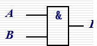
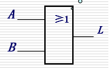
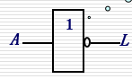
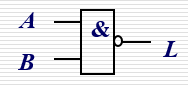
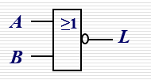
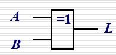
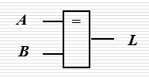
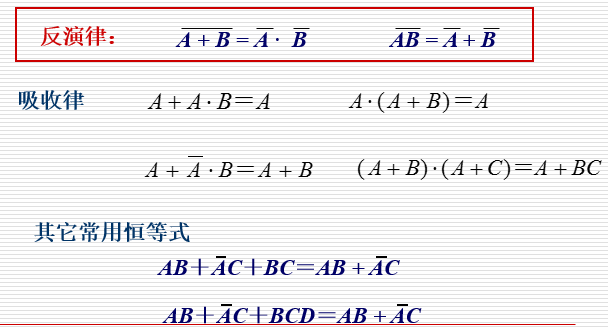
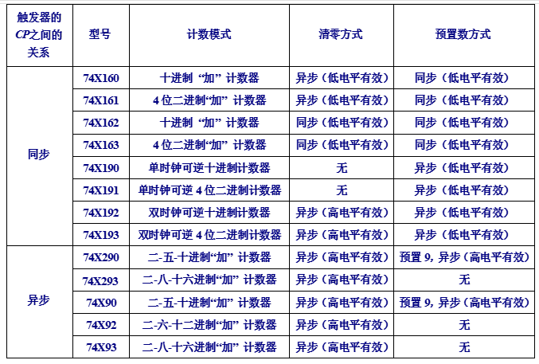

# 数电期末复习

## 第一章、数字逻辑基础

### 关系表示

与：

或：

非：

与非：

或非：

异或：  $\bigoplus$

同或：$\bigodot$

## 第二章、

### 代数法化简

\
$$
AB+\vec{A}C+BC = AB+\vec{A}C+ABC+\vec{A}BC
                                           =(AB + ABC)+ (\vec{A}C+\vec{A}BC)
                                           =AB+\vec{A}C
$$
证明：

> * 真值表
> * 代数法

> 非函数：加一个大的非号【与、或互换，变量因子加非】
>
> 对偶规则：与、或、0、1互换【可用于扩展已知的公式】

### 卡诺图化简

## 第三章、组合逻辑电路

主要内容:

### 一.组合逻辑电路的分析、组合逻辑电路的设计；

###  二.中规模组合集成器件 

      要求掌握常见几种组合逻辑模块的基本概念、基本电路的功能分析、集成电路的应用

 1.编码器：基本概念、**4/2线编码电路功能分析、8/3线优先编码及应用**

 2.译码器：基本概念、**2/4线译码电路功能分析、3/8线译码器应用**—

（1）实现逻辑函数（用于组合电路设计）；

（2）数据分配   二十进制译码器

 3.数据选择器：定义、**4选1电路功能分析、4选1和8选1的功能表及应用**----

（1）实现逻辑函数（用于组合逻辑电路设计）；

（2）并行数据到串行数据的转换

 4.数值比较器：定义、**一位二进制数比较功能分析**、集成比较器的位数扩展

 5.算术运算电路：**半加器、全加器的电路功能分析和设计**、集成四位数加法器的应用—

   构成减法、多位数加法

## 第四章、触发器

分类：*基本RS锁存器、同步RS锁存器、主从触发器、边沿触发器*

表示方法：**功能表、特性方程、状态转换图、驱动表、波形图**

锁存器和触发器的不同点：

> 锁存器：对脉冲**电平**敏感
>
> 触发器：对脉冲**边沿**敏感

## 第五章、时序逻辑电路

看到5.3的ppt了	

看到5.5的ppt了

## 第六章、555

看到25页

