# 第一章、引论

## 1\.编译程序的结构

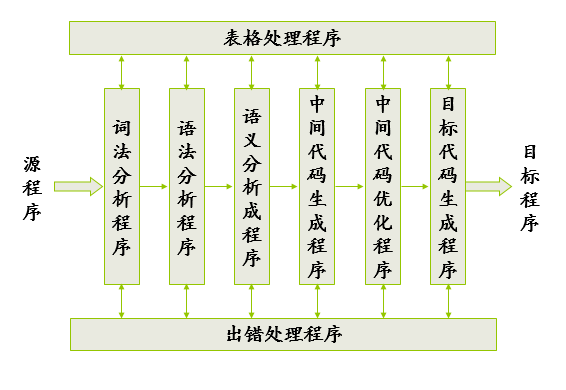

## 2\.前端和后端

前端后端分界线：中间代码优化

## 3\.遍

### 定义

对源程序或者中间代码程序从头到尾扫一次并完成相应的工作

## 4\.步骤

### 1\.词法分析

将代码扫描分解，识别出一个个的单词

### 2\.语法分析

判断是否符合语言的语法规则

### 3\.语义分析

审查是否有语义错误，并进行**类型检查** 

### 4\.中间代码生成

> 中间代码原则：
>
> 1.容易生成
>
> 2.容易翻译成目标代码

### 5\.中间代码优化

### 6\.目标代码生成

### 7\.目标代码优化

### 表格管理

> 记录标识符的名字、属性信息

### 出错处理

> 排错

# 第三章、文法和语言

## 1\.文法的构成

$$
G=(V_N,V_T,P,S)
$$

$V_N$表示非终结符集

$V_T$表示终结符集

P表示产生式

S表示文法开始符号
$$
V=V_N\bigcup V_T
$$
其中V为文法的字母表

## 2\.推导

### 1\.直接推导

推导一次得出

### 2\.推导

推导一次或者多次

### 3\.星推导

推导0次或者一次或者多次

## 3\.句型，句子，语言

句型包括句子，句子只有终结符，句型可以有非终结符，语言是一个文法所有句子的集合

## 4\.文法的类型

### 1\.   0型文法

短语结构文法

左边有非终结符

### 2\.   1型文法

上下文有关文法

左边长度小于右边

### 3\.   2型文法

上下文无关文法

左边只有一个

### 4\.   3型文法

正则文法

右边是aB或者a

### 5\.文法的关系

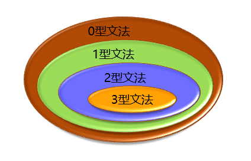

### 6\.文法的区分

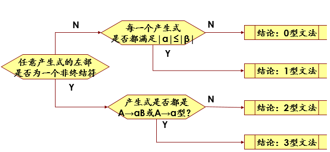

## 5\.语法树

> 用于判断某一个句子是不是此文法的句子

> 分类：
>
> ​	最左推导
>
> ​	最右推导（规范推导）--->规范句型

> 文法二义性：一个句子对应对各推导树
>
> 语言二义性：一个语言【句子的集合】对应一个或多个文法

> 短语、直接短语、句柄

# 第四章、词法分析

## 1\.自动机的概念

分类：确定有穷自动机（DFA），不确定有穷自动机（NFA）

## DFA定义

$$
M=(K,\sum,F,S,Z)
$$

K:状态集

$\sum$:输入符号表【有穷字母表】

F:状态转换函数

S:初始状态【唯一】

Z:终态集

### NFA定义

和DFA相似，区别

> NFA的输入符号表包括$\varepsilon $,即输入可以为空
>
> NFA的初态不唯一
>
> NFA的状态转换函数：一个输入可以跳转到多个状态

## 2\.状态图和状态转换矩阵

用于表示DFA,NFA

### 状态图

初始状态：用$\Rightarrow$加注

终止状态：状态用双圆圈圈起来

### 状态转换矩阵

初态同。末态用“1”标注

> DFA和NFA的接受：
>
> > 某一串输入串从初态开始，可以到达终止状态	

## 3\.NFA的确定化

要求：

>1.消除$\varepsilon$
>
>2.消除一个状态同一输入的多个输出
>
>3.消除多个初态

### **算法**

> 1.选取**所有**的初始状态为初始状态
>
> 2.写出同一输入得到的新状态集
>
> 3.求新状态集的$\varepsilon$闭包，若没有新状态集产生则结束
>
> 4.包含原NFA终止状态的新状态为确定化得到的DFA的终止状态

### 注意：优先选用状态转换矩阵来做确定化的工作，不要一条一条的写来求$\varepsilon-closure$【空闭包】，那样要写的字太多了，麻烦

## 4\.DFA的最小化

消除DFA中的多余状态、等价状态：

> 多余状态：
>
> > 1.不能到达
> >
> > 2.从此状态不能到达终止状态
>
> 等价状态：
>
> > 1.同时为可接受或者不可接受
> >
> > 2.输入同一输入符号值转到另一等价状态

### **算法**

>1.根据是否是终止状态集将所有的状态分为两类
>
>2.分别使用每个输入符号检测，看每个集合的每个状态会不会转到相同的集合，不能的话就拆分
>
>3.最后的同一集合中的状态即为等价状态

## **注意**：正规文法$\Leftrightarrow$正则表达式$\Leftrightarrow$有穷自动机【DFA,NFA】

# 第五章、自顶向下语法分析方法

> 语法分析方法结构如下：
>
> 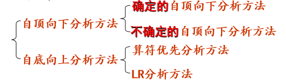
>
> *确定的*自顶向下分析方法可以根据下一个进入的终结符号判断要用那个产生式
>
> *不确定的*自顶向下分析方法不能做到，所以要用到**回溯**，效率低下

## 1\.LL(1)文法的定义，判别

### 1\.LL(1)文法的含义

>#### LL(X)文法的含义
>
>L:
>
>>使用自顶向下分析方法，从左到右扫描输入串
>
>L:
>
>>分析过程使用最左推导
>
>(X):
>
>>只需要看下一个输入符就能确定产生式

### 2\.LL(1)文法的判别

> **判别原则：只要能够根据下一个输入的终结符确定要用的推导式就行了，也就是说任何非终结符的N个推导式产生可能的第一个终结符没有交集**

判别工具：引入**FIRST,FOLLOW,SELECT**三个集合

### **FIRST**集

每个非终结符所能推出的第一个终结符的集合

> **注意：**如果非终结符右边的所有的都可以为$\varepsilon$

### **FOLLOW**集

一个非终结符后面跟着的第一个终结符的集合

> FOLLOW集求解方法：
>
> 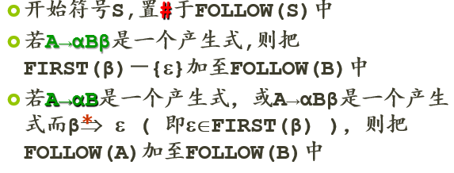

### **SELECT**集

一个产生式产生的第一个终结符的集合

> SELECT集的求解方法：
>
> 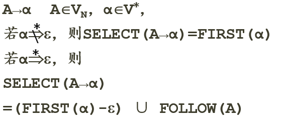

#### 可知，同一个非终结符的产生式的SELECT集没有交集的话，那么这个文法就是LL(1)文法

#### **注意:**FIRST可以有$\varepsilon$表示可以推出空，FOLLOW和SELECT没有$\varepsilon$符号，但是有”#“表示句子的开始结束

## 2\.非LL(1)文法转化为LL(1)文法

> 工作：
>
> > 1\.去除左公因子
> >
> > ​	提取左公因子，右边化成一个新的符号即可
> >
> > ​	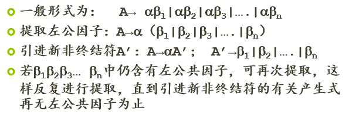
> >
> > ​	左公因子有两种情况：**直接的、间接的**
> >
> > ​	其中，间接的要自己先通过推导公式的迭代转化为直接的再去除公因子
>
> > 2\.去除左递归
> >
> > ​	左递归有两种情况：**直接左递归、间接左递归**
> >
> > ​	左递归去除方法如下：
> >
> > 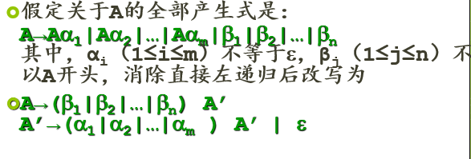
> >
> > 直接间接处理与上边相同
>
> **注意：**以上两步工作都有可能遇到这两中情况
>
> > 1\.产生[无用的产生式](# "从初始状态出发无法到达产生式的左部非终结符")
> >
> > 2.出现[死循环](# "无法在有限的步骤内完成化解，写明白就行了")

## 3\.了解*不确定的自顶向下分析方法*

不是重点，知道不是LL(1)文法，要回溯就行了

## 4\.掌握确定的自顶向下分析方法

### **这里确定的自顶向下分析方法都是针对LL(1)文法的，在用之前要先确定，如果不是LL(1)的话就先化成LL(1)**

### 递归子程序法

写个递归程序呗，不是重点，放过

### 预测分析表法

预测分析表的构造如图：

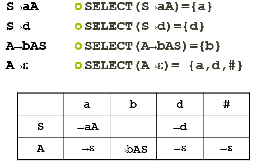

预测分析表的算法：

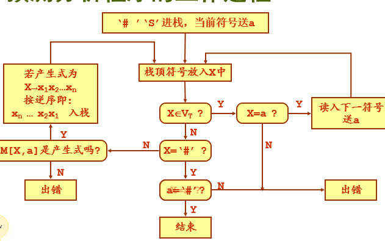

预测分析表运算时的过程规范：

匹配”i+i*i#”过程：

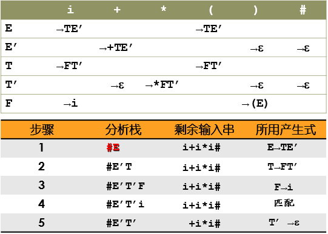

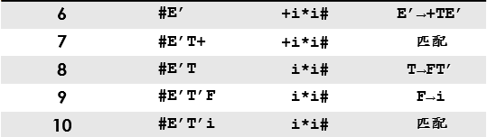

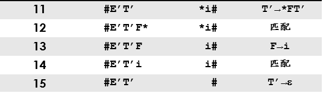

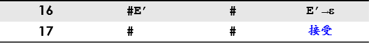

一定要严格按照这个格式写，不是意思对就行的，17步就i是17步

这个书写格式下：匹配$\V_T$出战算作单独的一步

# 第六章、优先分析方法

