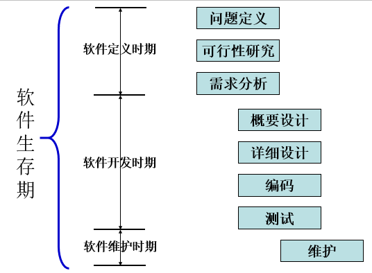

# 考试题型

名词解释、填空、选择、简答题、应用题（分析、设计、测试等）

# 软件工程复习大纲

## 第1章 软件与软件工程的概念

1. 了解与软件相关的基本概念，包括软件、程序、数据、文档。

>软件:
>
>> •软件是计算机系统中与硬件相互依存的另一部分，**它是包括程序，数据及其相关文档的完整集合**。
>
>程序：
>
>> •程序是按事先设计的功能和性能要求执行的**指令序列**。
>
>数据：
>
>> •数据是使程序能正常**操纵信息**的**数据结构**。
>
>文档：
>
>> •文档是与程序*开发*，*维护*和*使用*有关的**图文材料**。

2.了解软件危机的表现及发生的原因。

> 表现：
>
> > 软件的发展速度远远**滞后于硬件**的发展速度，**不能满足社会日益增长的软件需求**。软件开发**周期长、成本高、质量差、维护困难**。
>
> 典型表现（了解）：
>
> > Ø对软件开发成本和进度的估计常常很不准确。
> >
> > Ø用户对“已完成的”软件系统不满意的现象经常发生。
> >
> > Ø软件产品的质量往往靠不住。
> >
> > Ø软件常常是不可维护的。
> >
> > Ø软件通常没有适当的文档资料。
> >
> > Ø软件成本在计算机系统总成本中所占的比例逐年上升。
> >
> > Ø软件开发生产率提高的速度，既跟不上硬件的发展速度，也远远跟不上计算机应用迅速普及深入的趋势。
>
> 原因：
>
> >(1)**缺乏**软件开发的**经验**和有关软件开发**数据**的积累，使得开发工作的**计划很难制定**。
> >
> >(2)软件人员与用户的交流存在障碍，使得**获取的需求不充分或存在错误**。
> >
> >(3)软件**开发过程不规范**。如，没有真正了解用户的需求就开始编程序。
> >
> >(4)随着软件规模的增大，其复杂性往往会呈指数级升高。需要很多人分工协作，不仅涉及技术问题，更重要的是必须有**科学严格的管理**。
> >
> >(5)**缺少有效的软件评测手段**，提交用户的软件质量不能完全保证。    
>

3.掌握软件工程的概念。 

> •采用工程的概念、原理、技术和方法来开发与维护软件，把经过时间考验而证明正确的**管理技术**和当前能够得到的最好的**技术方法**结合起来，以*经济地开发出高质量的软件并有效地维护*它，这就是软件工程。

4.掌握软件工程方法学的三个基本要素及其作用。

>方法
>
>> 软件工程方法为软件开发提供了**“如何做”** 的技术;
>
>工具
>
>> 软件工具为软件工程方法提供了**自动的或半自动的软件支撑环境**
>
>过程
>
>> 过程是为了获得高质量的软件所需要完成的一系列任务框架，它**规定了完成各项任务的工作步骤**
>
>
>

5.了解传统方法及面向对象方法各自的特点。

> 传统方法（结构化方法）：
>
> > (1) 强调**自顶向下** *顺序地*完成软件开发的各阶段任务;
> >
> >   (2) 结构化方法要么面向行为，要么面向数据，缺乏使两者有机结合的机制。
>
> 面向对象方法:
>
> > Ø是将数据和对数据的操作紧密地结合起来的方法。
> >
> > Ø软件开发过程是多次反复迭代的演化过程。
> >
> > Ø面向对象方法在概念和表示方法上的一致性，保证了各项开发活动之间的平滑过渡。
> >
> > 对于大型、复杂及交互性比较强的系统，使用面向对象方法学更有优势

6.软件生命周期由哪三个时期组成，每个时期又可划分为哪些阶段？每个阶段的主要任务是什么？

> 生命周期：软件定义，软件开发，运行维护
>
> 
>
> 软件定义：
>
> > 问题定义:要解决的问题是什么
> >
> > •可行性研究:上一个阶段所确定的问题是否有行得通的解决办法
> >
> > •需求分析和定义:准确地回答“目标系统必须做什么”
>
> 软件开发：
>
> > Ø概要设计:–概括地回答“怎样实现目标系统?”。
> >
> > Ø详细设计:–回答“应该怎样具体地实现这个系统”。
> >
> > Ø程序编码和单元测试:写出正确的容易理解、容易维护的程序模块
> >
> > Ø集成测试和系统测试:–通过各种类型的测试(及相应的调试)使软件达到预定的要求。
>
> 运行维护：
>
> >主要任务是使软件持久地满足用户的需要，通常有4类维护活动：
> >
> >改正性维护，也就是诊断和改正在使用过程中发现的软件错误；
> >
> >适应性维护，即修改软件以适应环境的变化；
> >
> >完善性维护，即根据用户的要求改进或扩充软件，使它更完善；
> >
> >预防性维护，即修改软件为将来的维护活动预先做准备

7.了解SWEBOK指南将软件工程知识体系划分为哪些知识域。

> 15个，分为三类
>
> >Ø软件工程基础类：数学基础、计算基础、工程基础、软件工程经济学。
> >
> >Ø软件生存期过程类：软件工程模型和方法、软件需求、软件设计、软件构造、软件测试、软件维护。
> >
> >Ø软件工程管理类：软件工程过程、软件工程管理、软件配置管理、软件质量、软件工程专业实践。

## 第2章 软件生存期模型

1.     典型的生命周期模型(即软件过程模型)有哪几种，每种模型有哪些优缺点。

> (1)    **瀑布模型**
>
> **优点：**可强迫开发人员采用规范化的方法；严格地规定了每个阶段必须提交的文档；要求每个阶段交出的所有产品都必须经过质量保证小组的仔细验证。
>
> **缺点：**由于瀑布模型几乎完全依赖于书面的规格说明，很可能导致最终开发出的软件产品不能真正满足用户的需要；用户往往需要等待很长时间才能看到可以运行的程序；适应需求变更的能力比较差。
>
> **适用范围：**瀑布模型只适用于项目开始时需求已确定的情况。 
>
> (2)**快速原型模型**
>
> **优点：**有助于满足用户的真实需求；原型系统已经通过与用户的交互而得到验证，据此产生的规格说明文档能够正确地描述用户需求。
>
> **缺点：**要求开发人员快速建立原型。
>
> **适用范围：**适用于需求不明确的软件项目。
>
> (3)**增量模型**
>
> **优点：** 
>
> l  能在较短时间内向用户提交可完成一些基本功能的产品，即从第一个构件交付之日起，用户就能做一些有用的工作。
>
> l  逐步增加产品的功能可以使用户有较充裕的时间学习和适应新产品，从而减少一个全新的软件可能给用户组织带来的冲击。
>
> l  项目失败的风险较低，虽然在某些增量构件中可能遇到一些问题，但其他增量构件将能够成功地交付给客户。
>
> l  优先级最高的服务首先交付，然后再将其他增量构件逐次集成进来。因此，最重要的系统服务将接受最多的测试。
>
> **缺点：**
>
> l  在把每个新的增量构件集成到现有软件体系结构中时，必须不破坏原来已经开发出的产品。
>
> l  软件体系结构必须是开放的，即向现有产品中加入新构件的过程必须简单、方便。
>
> **适用范围：**适用于工期紧张、功能可以划分、比较复杂的软件项目。软件工程师必须有较高的技术水平，能够设计出开放的软件体系结构。
>
> (4)**螺旋模型**
>
> **优点：** 
>
> l  对可选方案和约束条件的强调有利于已有软件的重用，也有助于把软件质量作为软件开发的一个重要目标；
>
> l  减少了过多测试或测试不足所带来的风险；
>
> l  在螺旋模型中维护只是模型的另一个周期，在维护和开发之间并没有本质区别。
>
> **缺点：**螺旋模型是风险驱动的，因此要求软件开发人员必须具有丰富的风险评估经验和这方面的专门知识，否则将出现真正的风险：当项目实际上正在走向灾难时，开发人员可能还以为一切正常。 
>
> **适用范围：**适用于内部开发的大型软件（开发周期长、比较容易受到社会因素影响的软件项目），软件开发人员具有丰富的风险评估知识和经验。
>
> (5)**喷泉模型**
>
> **优点**：在开发过程中使用统一的概念和方法，各阶段之间没有明显的界限，容易实现各个开发过程的多次反复迭代，达到了认识的逐步深化，降低了出错的可能性。
>
> **缺点**：由于各个阶段之间的界线不明确，容易造成软件开发过程的无序。
>
> **适用范围：**适用于面向对象的软件开发。 
>
> (6)**统一过程**
>
> **优点：**提高了团队生产力，在迭代的开发过程、需求管理、基于组件的体系结构、可视化软件建模、验证软件质量及控制软件变更等方面，针对所有关键的开发活动为每个开发成员提供了必要的准则、模板和工具指导，并确保全体成员共享相同的知识基础。它建立了简洁和清晰的过程结构，为开发过程提供了较大的通用性。
>
> **缺点**：RUP只是一个开发过程，并没有涵盖软件过程的全部内容，例如它缺少关于软件运行和支持等方面的内容；此外，它没有支持多项目的开发结构，这在一定程度上降低了在开发组织内大范围实现重用的可能性。
>
> **适用范围：**适用于基于构件的软件开发。

2.     统一过程的6个核心工作流及4个阶段是什么？

> 6个核心工作流：
>
> > 业务建模工作流
> >
> > 需求工作流
> >
> > 分析和设计工作流
> >
> > 实现工作流
> >
> > 测试工作流
> >
> > 部署工作流
>
> 4个阶段：
>
> > 初始阶段、细化阶段、构造阶段和移交阶段

2.解释为什么基于构件的软件开发能够极大地提高软件开发的生产率和软件质量？

>  考虑的焦点是“集成”，而不再是“实现”。

3.敏捷软件开发的特点是什么？

> (1)我们最优先要做的是通过尽早、持续交付有价值的软件来使客户满意。
>
> (2)即使在开发的后期，也欢迎需求变更。敏捷过程利用变更为客户创造竞争优势。
>
> (3)经常交付可运行软件，交付的间隔可以从几个星期到几个月，交付的时间间隔越短越好。
>
> (4)在整个项目开发期间，业务人员和开发人员必须天天都在一起工作。  
>
> (5)围绕有积极性的个人构建项目。给他们提供所需的环境和支持，并且信任他们能够完成工作。
>
> (6)在团队内部，最富有效果和效率的信息传递方法是面对面交谈。
>
> (7)可运行软件是进度的首要度量标准。
>
> (8)敏捷过程提倡可持续的开发速度。责任人、开发者和用户应该能够保持一种长期、稳定的开发速度。
>
> (9)不断地关注优秀的技能和好的设计会增强敏捷能力。
>
> (10)简单是必要的。
>
> (11)好的架构、需求和设计出自于自组织团队。
>
> (12)每隔一定时间，团队会反省如何才能更有效地工作，并相应调整自己的行为。

## 第3章 软件需求获取与结构化分析方法

1. 了解软件需求获取的途径有哪些。
2. 掌握结构化分析模型的结构，主要由哪些模型组成?
3. 掌握环境图的作用及画法。
4. 掌握数据流图的画法及分层时需要注意的问题。
5. 掌握ER图的组成元素及数据建模方法。
6. 了解数据字典的定义方法。
7. 掌握使用判定表和判定树描述加工规格说明。

## 第4章 结构化设计方法

1. 了解结构化设计的基本原则、设计阶段和设计内容。
2. 掌握结构化设计的图形工具，了解宽度、深度、扇出、扇入的概念。    
3. 掌握面向数据流的设计方法和设计过程，能够区分两种典型的数据流，并掌握相应的变换分析方法及事务分析方法。
4. 软件模块结构的改进（启发式规则）

提高模块独立性、深度和宽度、扇出和扇入应适当、作用范围和控制范围原则等。

5. 人机交互设计的准则。

6. 了解结构化程序设计的概念，能够判别和改进非结构化程序。
7. 掌握常用的详细设计（过程设计）的描述工具。
8. 掌握自顶向下、逐步细化的设计方法。

## 第5章 面向对象方法与UML

1. 了解UML中的基本事物及其分类。
2. 了解UML中的常见关系，包括依赖关系、关联关系、泛化关系和实现关系。
3. 了解UML中6种类型的图，包括用例图、类图、交互图、状态图、活动图和实现图。

## 第6章 面向对象分析

1.  了解面向对象分析中的三个模型和五个层次。

2.  掌握有关用例模型、对象模型和动态模型的基本概念。

3.  了解使用Rational Rose建立用例模型、对象模型和动态模型(状态图和顺序图)的过程。

## 第7章 软件体系结构与设计模式

1. 典型的体系结构风格有哪些？每种风格中有代表性的体系结构有哪些？
2. 客户机/服务器(C/S)体系结构由哪几部分组成？
3. 了解C/S结构与B/S结构的特点。
4. 了解设计模式的概念及常用的设计模式有哪些？

## 第8章 面向对象设计

1. 了解面向对象的设计准则。
2. 了解软件系统分解的方法。
3. 掌握典型的面向对象设计模型。
4. 掌握4个子系统的设计方法。

## 第9章 软件实现

1. 了解程序设计语言的种类。
2. 了解选择程序设计语言时需要考虑的因素。
3. 理解程序设计风格和可读性的重要性。
4. 了解程序设计风格的4个方面。

## 第10章 软件测试方法

1. 了解软件测试的概念和软件测试的对象。
2. 了解测试与软件开发各阶段的关系。
3. 掌握白盒测试中使用各种逻辑覆盖的测试用例设计方法。
4. 掌握程序控制流图的画法及环路复杂性的计算方法。

5. 掌握黑盒测试用例设计的方法：等价类划分法、边界值分析。
6. 了解软件测试的步骤和策略，包括单元测试、组装测试、确认测试和系统测试。
7. 了解α测试和β测试的概念。

